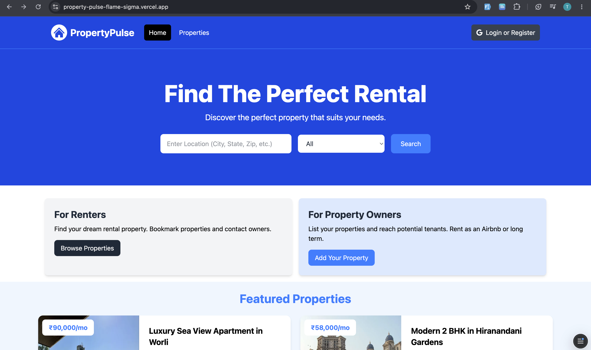

# 🏠 PropertyPulse

<p align="center">
  
</p>

<p align="center">
A modern full-stack property rental platform built with Next.js, MongoDB, NextAuth, Cloudinary, Leaflet, and OpenStreetMap.
</p>

<p align="center">
<a href="https://property-pulse-flame-sigma.vercel.app/">🌐 Live Demo</a> •
<a href="https://github.com/tishaaparmar/property-pulse">💻 GitHub Repository</a>
</p>

---

# 📖 Overview

PropertyPulse is a full-stack property rental platform that enables users to discover rental properties, search by location and property type, list their own properties, bookmark favorites, communicate with property owners, and manage listings through a personalized dashboard.

The application is built using the Next.js App Router and follows modern web development practices with server-side rendering, authentication, image optimization, and responsive design.

---

# ✨ Features

## Authentication

- Google Authentication using NextAuth
- Secure login and logout
- Protected routes
- Session management
- User-specific dashboard

---

## Property Listings

- Browse available rental properties
- Featured property section
- Detailed property pages
- Property amenities
- Seller information
- Responsive property cards

---

## Property Management

Authenticated users can:

- Add new properties
- Edit existing properties
- Delete listings
- Upload multiple property images
- Manage listings from their profile dashboard

---

## Cloudinary Integration

- Multiple image uploads
- Secure cloud storage
- Optimized image delivery
- Responsive images
- Full-screen image gallery using PhotoSwipe

---

## Property Search

Search properties using:

- Property name
- Description
- Street
- City
- State
- Zipcode
- Property type

---

## Bookmarks

- Save favorite properties
- Remove bookmarks
- Dedicated bookmarks page
- Personalized saved listings

---

## Messaging System

- Contact property owners
- Receive inquiries
- Reply to messages
- Delete conversations
- Read/Unread status
- Live unread message notifications

---

## User Dashboard

- Profile management
- View listed properties
- Manage saved properties
- Access received messages

---

## Pagination

- Dynamic pagination
- Previous & Next navigation
- Optimized database queries

---

## Interactive Maps

Each property includes an interactive map powered by:

- Leaflet
- React Leaflet
- OpenStreetMap

Features include:

- Property location marker
- Zoom controls
- Interactive map
- Address popup

---

## Responsive Design

- Mobile-first design
- Tablet optimized
- Desktop responsive
- Tailwind CSS UI

---

# 🛠 Tech Stack

## Frontend

- Next.js (App Router)
- React
- Tailwind CSS
- React Icons
- React Toastify

## Backend

- Next.js Server Actions
- MongoDB
- Mongoose

## Authentication

- NextAuth
- Google OAuth

## Cloud Storage

- Cloudinary

## Maps

- Leaflet
- React Leaflet
- OpenStreetMap

## Image Gallery

- PhotoSwipe
- React PhotoSwipe Gallery

---

# 📂 Folder Structure

```text
app/
│
├── actions/
├── api/
├── messages/
├── profile/
├── properties/
│   ├── add/
│   ├── edit/
│   ├── saved/
│   ├── search-results/
│   └── [id]/
│
components/
config/
context/
models/
public/
utils/
```

---

# 🚀 Getting Started

## Clone Repository

```bash
git clone https://github.com/tishaaparmar/property-pulse.git
```

```bash
cd property-pulse
```

---

## Install Dependencies

```bash
npm install
```

---

## Environment Variables

Create a `.env.local` file.

```env
# MongoDB
MONGODB_URI=

# NextAuth
NEXTAUTH_URL=http://localhost:3000
NEXTAUTH_SECRET=

# Google OAuth
GOOGLE_CLIENT_ID=
GOOGLE_CLIENT_SECRET=

# Cloudinary
CLOUDINARY_CLOUD_NAME=
CLOUDINARY_API_KEY=
CLOUDINARY_API_SECRET=
```

---

## Run the Project

```bash
npm run dev
```

Open:

```
http://localhost:3000
```

---

# 📸 Application Preview

## Home Page


---

# 📦 Main Dependencies

```text
next
react
react-dom
tailwindcss
mongoose
next-auth
cloudinary
leaflet
react-leaflet
photoswipe
react-photoswipe-gallery
react-icons
react-toastify
```

---

# 📚 Concepts Practiced

- Next.js App Router
- Server Components
- Client Components
- Dynamic Routing
- Server Actions
- CRUD Operations
- Authentication
- Authorization
- MongoDB & Mongoose
- Cloudinary Integration
- Image Optimization
- Interactive Maps
- Property Search
- Pagination
- Bookmark System
- Messaging System
- Reply Functionality
- Responsive UI
- Error Handling
- Loading States

---

# 🌟 Highlights

- Google Authentication
- Property CRUD Operations
- Cloudinary Image Uploads
- Property Search
- Bookmarks
- Internal Messaging
- Reply Functionality
- Unread Notifications
- Interactive Maps
- Full-Screen Image Gallery
- Responsive Design
- Production Deployment on Vercel

---

# 🔮 Future Improvements

- Advanced property filters
- Property reviews
- Email notifications
- Real-time messaging
- Admin dashboard
- Property recommendations
- Payment integration
- Wishlist sharing
- Dark mode

---

# 🌐 Live Demo

https://YOUR_VERCEL_LINK

---

# 👩‍💻 Author

**Tisha Parmar**

GitHub: https://github.com/tishaaparmar

LinkedIn: https://www.linkedin.com/in/YOUR-LINKEDIN

---

# 📄 License

This project is intended for educational and portfolio purposes.